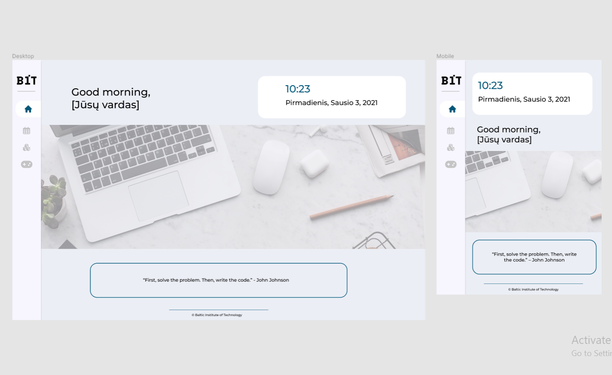
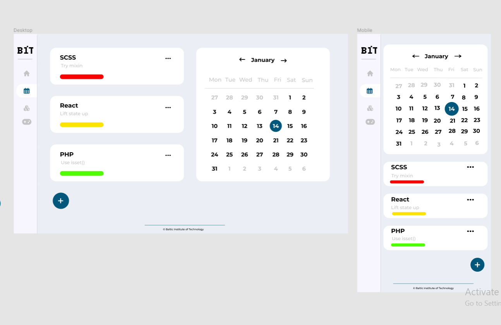

# Figma project

_35 group website project_

This project is for **educational** purposes, encouraging students to improve HTML, CSS, JS and other front-end skills by building various components and simple JS games.

Site published at: https://kristle22.github.io/friday-challenge-figma/

Figma design:

# Home Page

# Calendar

## Project features

- Github pages (multi-page)
- HTML form
- Figma project
- fixed nav
  -linear-gradient backgraound
  -current Date & Timers (Javascript)

## Authors

Kristina: [Github](https://github.com/Kristle22)
